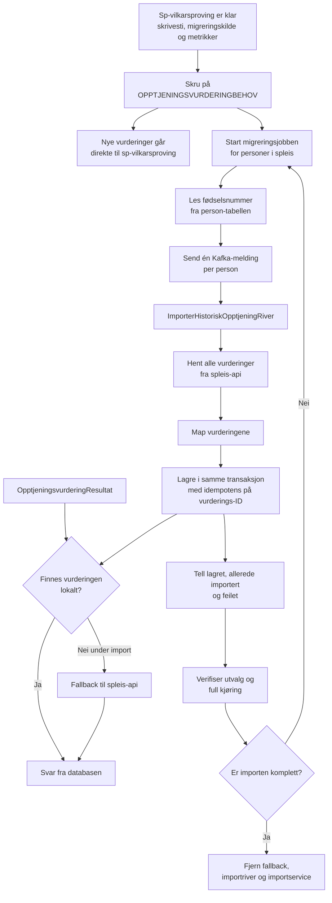
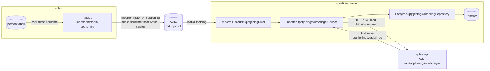

# Migrering av historiske opptjeningsvurderinger fra spleis

## Mål

Alle opptjeningsvurderinger som i dag bare finnes i person-JSON-en i spleis skal ligge som rader i
databasen til sp-vilkarsproving. Når migreringen er ferdig, kan sp-vilkarsproving svare på
`OpptjeningsvurderingResultat` og API-oppslag fra speil uten å slå opp i spleis-api.

## Valgt løsning

Vi lager en naisjob i spleis som leser fødselsnummer fra `person`-tabellen og sender én
Kafka-melding per person på `tbd.rapid.v1`. sp-vilkarsproving får en river som henter personens
opptjeningsvurderinger fra `spleis-api`, mapper dem og lagrer dem.

Spleis eier person-tabellen og har allerede mønstre for både enkel og parallellisert iterering.
sp-vilkarsproving har allerede lesestien mot spleis, inkludert `SpleisClient`,
`SpleisOpptjeningsvurdering` og `tilOpptjeningsvurdering`. Mapping og lagring skjer dermed i
appen som skal eie dataene videre.

`opptjeningsvurderingId` fra spleis blir primærnøkkel i sp-vilkarsproving. Vi importerer alle tre
variantene: `SpleisArbeidstaker`, `SpleisSelvstendig` og `InfotrygdArbeidstaker`. Vi kan derfor
kjøre jobben på nytt uten å duplisere vurderinger.

Alternativet er at spleis-jobben gjenoppretter `Person` selv og publiserer ferdig mappede
vurderinger. Det sparer HTTP-kall mot spleis-api, men dupliserer JSON-tolkingen. Vi velger bare
den løsningen hvis lasttesten viser at spleis-api ikke tåler volumet.

## Flyt



## Runtime-arkitektur



## Dagens situasjon

### sp-vilkarsproving

- `SpleisClient` kaller `POST http://spleis-api/api/opptjeningsvurderinger` med fødselsnummer og
  får alle opptjeningsvurderinger for personen.
- `SpleisOpptjeningsvurderingService` brukes bare som fallback ved lesing og lagrer ikke resultatet.
- `OpptjeningsvurderingResultatRiver` slår først opp lokalt og faller tilbake til spleis når
  vurderingen mangler.
- `tilOpptjeningsvurdering` mapper `SpleisArbeidstaker`, `SpleisSelvstendig` og
  `InfotrygdArbeidstaker`. `Vurderingskilde.OverførtFraSpleis` finnes allerede for
  vilkårsvurderingene.
- `PostgresOpptjeningsvurderingRepository.lagre` skriver til `opptjeningsvurdering`,
  `vilkarsvurdering` og koblingstabellen. Unikhetsbrudd på id blir `IllegalStateException`.
- Gjeldende vurdering velges på `vurdert_tidspunkt DESC, opprettet DESC`. Migrering `V18` fjernet
  `løpenummer` fra `opptjeningsvurdering`.

Det som mangler er en skrivesti for overførte vurderinger og en måte å starte importen for alle
personer.

### spleis

- `person.data` inneholder hele personaggregatet som JSON. Det finnes ingen normalisert tabell over
  vedtaksperioder eller opptjeningsvurderinger.
- `OpptjeningApi` gjenoppretter `Person`, flater ut `vilkårsgrunnlagHistorikk` og dedupliserer på
  `opptjeningsvurderingId`. Ett kall returnerer alle vurderingene for personen.
- `jobs`-modulen har enkel iterering med `SELECT fnr FROM person` og parallellisert iterering med
  `arbeidstabell` og `FOR UPDATE SKIP LOCKED`.
- Toggelen `OPPTJENINGSVURDERINGBEHOV` er satt i `deploy/dev.yml`, men ikke i `deploy/prod.yml`.
  I prod lager spleis derfor fortsatt opptjeningsvurderingene selv.

En opptjeningsvurdering identifiseres av `opptjeningsvurderingId`, ikke av `vedtaksperiodeId`.
Samme vurdering kan ligge i flere vedtaksperioder. Vi migrerer derfor per person og
`opptjeningsvurderingId`.

## Samtidighet

### 1. Skru på `OPPTJENINGSVURDERINGBEHOV` i prod før importen

`Toggle.OpptjeningsvurderingBehov` styrer om spleis sender behovet `Opptjeningsvurdering` til
sp-vilkarsproving. Vi skrur på toggelen før backfillen starter.

Etter cutover lager ikke spleis nye vurderinger på egen hånd. Revurderinger går gjennom
`OpptjeningsvurderingRiver` og skrives direkte i sp-vilkarsproving. Historikken som skal
migreres blir dermed en lukket mengde.

Cutover forutsetter at sp-vilkarsproving allerede svarer riktig på `Opptjeningsvurdering` og
`OpptjeningsvurderingResultat` i prod. `OpptjeningsvurderingResultat` fungerer allerede med
fallback mot spleis-api.

### 2. Behold fallbacken under importen

`OpptjeningsvurderingResultatRiver` henter allerede vurderingen fra spleis når den mangler lokalt,
og svarer på behovet. Fallbacken skal være skrivebeskyttet mens importen kjører.

Etter at importen er verifisert, skal vi fjerne fallbacken. Da svarer
`OpptjeningsvurderingResultatRiver` bare fra databasen i sp-vilkarsproving.

### 3. Serialiser per person

Importmeldingen skal bruke fødselsnummer som Kafka-nøkkel. Da havner importmeldingen og
`Opptjeningsvurdering`-behovet for samme person i samme partisjon og behandles etter hverandre.

Dette dekker ikke vurderinger som kommer inn via HTTP fra speil. De håndteres av tidsstemplene og
idempotensen beskrevet under.

## Ting vi må løse før importen

### Bevar tidspunktet vurderingen ble gjort

`gjeldende` rangerer nå på `vurdert_tidspunkt`, ikke på innsettingsrekkefølge. API-et fra spleis
sender ikke dette tidspunktet for `SpleisArbeidstaker` eller `SpleisSelvstendig`, og mapperen
lagrer derfor importerte vurderinger med tidspunktet de ble importert.

Utvid svaret fra spleis-api med tidspunktet vurderingen ble gjort, og legg det på
`SpleisOpptjeningsvurdering`. `tilOpptjeningsvurdering` skal føre tidspunktet videre til
`Vilkårsvurdering.overførtFraSpleis`. Da vil den sist vurderte vurderingen være gjeldende også når
flere vurderinger har samme skjæringstidspunkt.

### Skill overførte vurderinger fra vurderinger gjort i speil

`lagreVurdertISpeil` setter i dag `opptjeningsvurdering.vurderingskilde` til
`VURDERT_I_SPEIL`, også når vilkårsvurderingens kilde er `OVERFOERT_FRA_SPLEIS`. Vi trenger en
egen verdi på opptjeningsvurderingen for å måle og kunne rulle tilbake importen.

Legg til `OVERFOERT_FRA_SPLEIS` i en ny Flyway-migrering. Utvid domenet og repositoryet slik at
overførte vurderinger skrives og hydrereres med denne kilden.
`VURDERT_I_SPEIL` beholdes for vurderinger appen har gjort selv.

### Ikke hopp over nyere vurderinger

Importen skal bare hoppe over vurderinger som allerede finnes på
`opptjeningsvurderingId`. Den skal ikke hoppe over alle vurderinger med samme
`(fødselsnummer, skjæringstidspunkt)`: en revurdering i spleis har ny id og kan være gjeldende.

Sjekk og innsetting skjer i samme transaksjon. Fang `IllegalStateException` fra unikhetsbrudd og
tell den som «allerede importert».

### Ikke publiser ved import

Importen skal ikke publisere løsninger eller andre hendelser på rapid-en. Kontroller at
skrivestien ikke legger noe i outbox-tabellen.

## Faser

### Fase 1: gjør sp-vilkarsproving klar

1. Utvid spleis-api og `SpleisOpptjeningsvurdering` med tidspunktet vurderingen ble gjort.
2. Lag en Flyway-migrering med `OVERFOERT_FRA_SPLEIS` som vurderingskilde for
   `opptjeningsvurdering`.
3. Utvid domenet og `PostgresOpptjeningsvurderingRepository` slik at overførte vurderinger skrives
   og leses med den nye kilden, og med vurderingstidspunktet fra spleis.
4. Lag `ImporterOpptjeningsvurderingerService` i `application`:
   - Hent alle vurderinger fra `SpleisClient`.
   - Map med `tilOpptjeningsvurdering(fødselsnummer)`.
   - Lagre hver vurdering som ikke allerede finnes på id.
   - Returner antall lagret, allerede importert og feilet.
5. Lag `ImporterHistoriskOpptjeningRiver` i `infra/kafka`. Den matcher
   `@event_name = "importer_historisk_opptjening"` og `fødselsnummer`, og publiserer ikke på
   rapid-en.
6. Legg til Prometheus-metrikker for lagret, allerede importert og feilet, samt histogram for tid
   per person.
7. Test importservice, rekkefølgen for flere vurderinger med samme skjæringstidspunkt,
   idempotens og riveren mot testdatabasen.

Etter fase 1 er appen deployet, men ingen sender importmeldinger.

### Fase 2: skru på ny vurderingsflyt i prod

Sett `OPPTJENINGSVURDERINGBEHOV=true` i `deploy/prod.yml` i spleis. Følg med på at
`Opptjeningsvurdering`-behovet besvares, og at spleis bruker id-en fra løsningen i
vilkårsgrunnlaget. Gå videre først når dette er stabilt.

### Fase 3: verifiser på et lite utvalg

1. Kjør i dev først. Send meldingen manuelt for et titalls fødselsnummer og sammenlign dataene i
   databasen med svaret fra spleis-api.
2. I prod sender vi meldingen for 100 til 1000 personer, for eksempel med `mod(fnr, N)`.
3. Mål kostnaden per kall mot spleis-api og beregn hvor lang tid full kjøring tar ved en forsvarlig
   rate.
4. Sjekk at `OpptjeningsvurderingResultatRiver` svarer fra lokal database for importerte personer.

Hvis kallene er for dyre, bytter vi til varianten der spleis-jobben publiserer de ferdig mappede
vurderingene.

### Fase 4: full kjøring

1. Lag en task i `jobs`-modulen i spleis etter mønster fra `migrateTask`:

   ```kotlin
   "importer_historisk_opptjening" -> importerHistoriskOpptjeningTask(factory)
   ```

   Tasken bruker `opprettOgUtførArbeid` med `arbeidstabell`, slik at flere pods kan dele arbeidet
   og en avbrutt kjøring kan fortsette. Per fødselsnummer sender den:

   ```json
   {
     "@id": "...",
     "@event_name": "importer_historisk_opptjening",
     "@opprettet": "...",
     "fødselsnummer": "..."
   }
   ```

2. Legg jobben inn i `.github/workflows/spleis-jobs.yml` med `arbeid_id` som parameter.
3. Start med lav parallellitet og øk mens dere følger responstiden i spleis-api, consumer lag på
   `tbd.rapid.v1` og CPU i sp-vilkarsproving.
4. Kjør jobben på nytt med samme `arbeid_id` hvis den stopper. `arbeidstabell` husker ferdige
   personer, og importen er idempotent.

### Fase 5: verifiser og rydd

1. Sammenlign antall rader med `vurderingskilde = 'OVERFOERT_FRA_SPLEIS'` med antall personer i
   spleis som har vilkårsgrunnlag. Forvent avvik for personer uten vilkårsgrunnlag og personer med
   vurderinger som allerede var lagret lokalt.
2. Ta stikkprøver: sammenlign tilfeldige svar fra spleis-api med radene i databasen.
3. Kjør jobben med nytt `arbeid_id` for personer batchen feilet på. Gjenta til det ikke finnes
   feilede personer.
4. Fjern fallbacken i `OpptjeningsvurderingResultatRiver` først når importen er komplett,
   inkludert alle tidligere feilede personer. Riveren skal da feile tydelig hvis en vurdering
   mangler.
5. Fjern importriveren og `ImporterOpptjeningsvurderingerService` når importen er verifisert. 

## Idempotens og rollback

Importen er idempotent fordi `opptjeningsvurdering.id` er `opptjeningsvurderingId` fra spleis.

Rollback sletter koblingene og de overførte vurderingene:

```sql
DELETE FROM opptjeningsvurdering_vilkarsvurdering
WHERE opptjeningsvurdering_id IN (
  SELECT id
  FROM opptjeningsvurdering
  WHERE vurderingskilde = 'OVERFOERT_FRA_SPLEIS'
);

DELETE FROM opptjeningsvurdering
WHERE vurderingskilde = 'OVERFOERT_FRA_SPLEIS';
```

Slett også vilkårsvurderinger som ikke lenger er koblet til en opptjeningsvurdering. Skriv og test
hele rollback-skriptet i dev før fase 4.


## Ting å avklare

- Er sp-vilkarsproving klar til at `OPPTJENINGSVURDERINGBEHOV` skrus på i prod?
- Kan spleis-api levere et korrekt vurderingstidspunkt for historiske vurderinger?

## Filer som blir berørt

I sp-vilkarsproving:

- En ny Flyway-migrering for `OVERFOERT_FRA_SPLEIS`
- `sp-vilkarsproving/.../application/ImporterOpptjeningsvurderingerService.kt` (ny)
- `sp-vilkarsproving/.../infra/kafka/ImporterHistoriskOpptjeningRiver.kt` (ny)
- `sp-vilkarsproving/.../infra/kafka/OpptjeningsvurderingResultatRiver.kt`
- `sp-vilkarsproving/.../infra/db/PostgresOpptjeningsvurderingRepository.kt`
- `sp-vilkarsproving/.../domain/Opptjeningsvurdering.kt`
- `sp-vilkarsproving/.../infra/spleis/SpleisOpptjeningsvurdering.kt`
- `sp-vilkarsproving/.../infra/spleis/SpleisOpptjeningsvurderingTilOpptjeningsvurdering.kt`
- `sp-vilkarsproving/.../bootstrap/App.kt`

I spleis:

- Endepunktet som leverer opptjeningsvurderinger
- `deploy/prod.yml` (`OPPTJENINGSVURDERINGBEHOV`)
- `jobs/src/main/kotlin/no/nav/helse/spleis/jobs/App.kt`
- `.github/workflows/spleis-jobs.yml`
